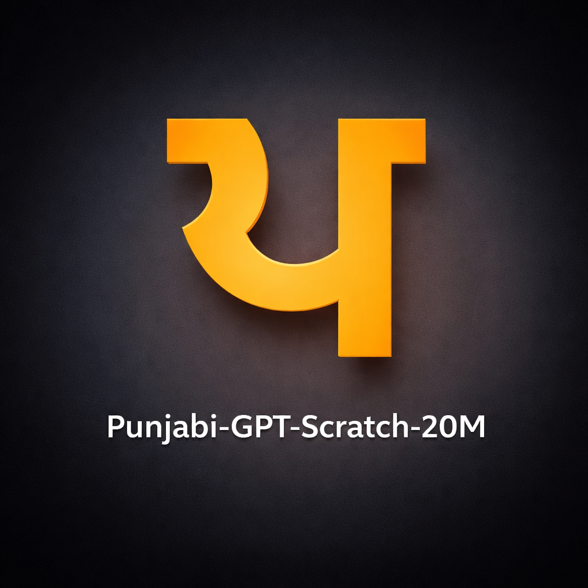

# Punjabi-GPT-Scratch-20M
<div align="center">

</div>

A 20.39M-parameter Punjabi decoder-only causal language model trained **from scratch** on Punjabi (Gurmukhi) text using **Hugging Face Transformers**, a custom tokenizer, and **Apple Silicon MPS** acceleration.

This project demonstrates an end-to-end local language model pipeline for Punjabi:
- corpus download
- corpus cleaning and filtering
- tokenizer training
- GPT-style model design
- scratch pretraining
- benchmarking
- Punjabi text generation

---

## Highlights

- Trained a **Punjabi base language model from scratch**
- Built and used a **custom Punjabi tokenizer**
- Ran training **locally on Apple Silicon**
- Benchmarked the model using **validation loss, perplexity, and fixed prompts**
- Established a strong **baseline model** for future continued pretraining and instruction tuning

---

## Model Overview

- **Model name:** Punjabi-GPT-Scratch-20M
- **Model type:** Decoder-only causal language model
- **Language:** Punjabi (Gurmukhi)
- **Parameter count:** 20,389,632
- **Tokenizer vocab size:** 16,000
- **Context length:** 128
- **Training objective:** Causal Language Modeling (next-token prediction)

---

## Dataset and Preprocessing

The base model was trained on a cleaned Punjabi corpus derived from Punjabi/Gurmukhi text data.

### Corpus Summary
- **Original rows used:** 200,000
- **Filtered rows:** 193,009
- **Removed rows:** 6,991
- **Total characters:** 583,626,806
- **Total words:** 110,110,073
- **Approx token estimate:** 116M–194M

### Preprocessing Steps
- removed empty and low-quality rows
- filtered short/noisy samples
- measured Gurmukhi ratio
- deduplicated text where required
- exported cleaned corpus for tokenizer training and model training

---

## Tokenizer

A Punjabi tokenizer was trained locally on the cleaned corpus.

### Tokenizer Details
- **Vocabulary size:** 16,000
- **Round-trip decode test:** passed
- **Estimated chars/token:** ~1.60
- **Estimated total tokens in corpus:** ~363.7M using trained tokenizer estimate

> Note: this repository uses the first working tokenizer/model baseline. Future work includes improving tokenizer efficiency for Punjabi morphology.

---

## Training Setup

### Hardware
- Apple Silicon Mac with MPS acceleration

### Training Configuration
- **Architecture:** GPT-style decoder-only LM
- **Epochs:** 2
- **Batch size:** 2
- **Learning rate:** 3e-4
- **Weight decay:** 0.01
- **Context length:** 128
- **Framework:** PyTorch + Hugging Face Transformers

### Model Configuration
- **Vocab size:** 16,000
- **Embedding dimension:** 384
- **Layers:** 8
- **Attention heads:** 6
- **Context positions:** 128

---

## Results

### Training Results
- **Train loss:** 1.7447409525251782
- **Validation loss (Epoch 1):** 1.561607
- **Validation loss (Epoch 2):** 1.416886
- **Training runtime:** ~2h 37m

### Benchmark Results
- **Parameter count:** 20,389,632
- **Perplexity:** 7.0229
- **Average Gurmukhi ratio:** 0.9466
- **Average repetition rate (3-gram words):** 0.0481
- **Average generated length:** 198.7 characters / 38 words

### Interpretation
The model:
- generates valid Punjabi script with high Gurmukhi consistency
- produces article-like and definition-style continuations
- shows low short-range repetition
- still has semantic drift and factual hallucination, as expected for a small base model

---

## Sample Outputs

### Prompt
`ਪੰਜਾਬੀ ਭਾਸ਼ਾ`

### Output
`ਪੰਜਾਬੀ ਭਾਸ਼ਾ ਕੋਰੀਆ ਦੇ ਬੋਹੀਮੀਅਨ ਰਾਜ ਵਿੱਚ ਇੱਕ ਪ੍ਰਾਚੀਨ ਪੱਥਰ ਦਾ ਭਾਸ਼ਾ ਹੈ। ਇਹ ਪੱਥਰ ਦੇ ਨੇਡ਼ੇ ਇੱਕ ਪ੍ਰਤੱਖ ਭੂਮੀਗਤ ਮੈਂਬਰ ਹੈ ਜਿਸ ਦਾ ਵਰਣਨ ਪਹਿਲੀ ਵਾਰ 2011 ਵਿੱਚ ਨਿਕੋਲਾ ਕਾਮਿਨ ਦੁਆਰਾ ਕੀਤਾ ਗਿਆ`

---

### Prompt
`ਇੱਕ ਪਿੰਡ ਵਿੱਚ`

### Output
`ਇੱਕ ਪਿੰਡ ਵਿੱਚ ਸੂਚੀਬੱਧ ਇਮਾਰਤਾਂ ਇੱਕ ਇਤਿਹਾਸਕ ਇਮਾਰਤ ਹੈ ਜੋ ਇੱਕ ਗ੍ਰੇਡ II ਸੂਚੀਬੱਧ ਇਮਾਰਤ ਵਜੋਂ ਸੂਚੀਬੱਧ ਹੈ। ਇਮਾਰਤ ਨੂੰ ਇੱਕ ਸਿਵਲ ਪੈਰੀਸ਼ ਦੇ ਰੂਪ ਵਿੱਚ ਸੂਚੀਬੱਧ ਇਮਾਰਤ ਵਜੋਂ ਦਰਜ ਕੀਤਾ`

---

### Prompt
`ਅੱਜ ਦੇ ਸਮੇਂ ਵਿੱਚ ਸਿੱਖਿਆ`

### Output
`ਅੱਜ ਦੇ ਸਮੇਂ ਵਿੱਚ ਸਿੱਖਿਆ (ਜਿਸ ਨੂੰ ਅੱਜ ਦੇ ਸਮੇਂ ਵੀ ਕਿਹਾ ਜਾਂਦਾ ਹੈ) ਇੱਕ ਵਿਦੇਸ਼ੀ ਕੰਪਲੈਕਸ ਹੈ ਜੋ ਇੱਕ ਸਿੱਖਿਆ ਦੀ ਖੋਜ ਅਤੇ ਵਿਸ਼ੇਸ਼ਤਾ ਲਈ ਅੱਜ ਦੇ ਸਮੇਂ ਵਿੱਚ ਸਿੱਖਿਆ ਦੀ ਪੇਸ਼ਕਸ਼ ਕਰਦਾ ਹੈ। ਅੱਜ, ਜੋਰ, ਵ`

> These outputs are baseline generations from the first scratch-trained model and are included to show raw model behavior before any instruction tuning.

---

## Repository Structure

```text
.
├── README.md
├── requirements.txt
├── .gitignore
├── LICENSE
├── model_card.md
├── scripts/
│   ├── generate.py
│   ├── benchmark.py
│   └── inspect_model.py
├── notebooks/
│   ├── notebook1_download.ipynb
│   ├── notebook2_corpus_analysis.ipynb
│   ├── notebook3_tokenizer.ipynb
│   ├── notebook4_train_scratch_gpt.ipynb
│   └── notebook5_benchmark.ipynb
├── outputs/
│   ├── corpus_summary.json
│   ├── tokenizer_summary.json
│   ├── benchmark_report.json
│   └── benchmark_samples.txt
├── assets/
│   └── sample_outputs.md
└── data/
    └── README.md
```
## > Note:
- the repository currently does not include the trained model weight files due to file size constraints.
- To run inference, place the trained model directory inside `outputs/` or update the script path accordingly.
  
# Punjabi GPT Training Pipeline

## Installation

1. **Clone the repository**
   ```bash
   git clone https://github.com/gurpejsingh13/punjabi-gpt-scratch-20m.git
   cd punjabi-gpt-scratch-20m
   ```
2. **Create and activate virtual environment**
   ```bash
   python3 -m venv .venv
   source .venv/bin/activate
    ```
3. **Install dependencies**
   ```bash
   pip install --upgrade pip
   pip install -r requirements.txt
   ```

# Usage 

## Run inference
```bash
python scripts/generate.py --model_dir outputs/punjabi-gpt-scratch-20m-final --prompt "ਪੰਜਾਬੀ ਭਾਸ਼ਾ"
```

## Inspect model details
```bash
python scripts/inspect_model.py --model_dir outputs/punjabi-gpt-scratch-20m-final
```
## Run benchmark
```bash
python scripts/benchmark.py --model_dir outputs/punjabi-gpt-scratch-20m-final
```
# Current Limitations

- Small model size compared to modern large language models
- Short context window (128)
- Not instruction-tuned yet
- Can generate factually incorrect content
- Still shows semantic drift on longer continuations
- Tokenizer can be further improved for Punjabi morphology

# Future Work
- Improve tokenizer quality for Punjabi
- Increase context length
- Continue pretraining on more Punjabi data
- Perform supervised fine-tuning / instruction tuning
- Compare against multilingual and Punjabi-specific baselines
- Evaluate with more formal human and automatic metrics

# Intended Use

## This model is intended for:
- Research
- Experimentation
- Educational work
- Punjabi NLP exploration
- Further adaptation and instruction tuning

## Not intended for:
- Legal advice
- Medical advice
- Financial advice
- High-stakes factual decision-making

# Acknowledgment
This project was built as an experimental Punjabi language modeling pipeline using publicly accessible Indic-language resources and local Apple Silicon acceleration.
